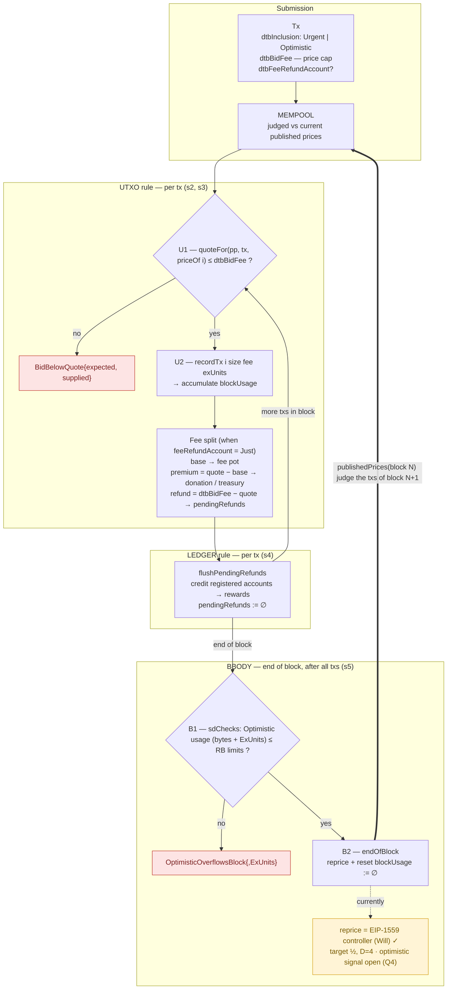

# Dynamic Pricing — design flow (tx + block lifecycle)

Visual companion to [`DYNAMIC_PRICING_LEDGER_RULES.md`](./DYNAMIC_PRICING_LEDGER_RULES.md).
Shows where each ledger rule acts on a transaction and how the pricing state evolves
from one block to the next. Praos-only (every block is an RB).

> Renders natively in VSCode (Markdown Preview) and on GitHub. Edit the mermaid block
> below as the implementation evolves — keep it in sync with the spec sections (s1–s5).

## Legend

- 🔴 red nodes — the four new predicate failures (`BidBelowQuote`,
  `OptimisticOverflowsBlock`, `OptimisticOverflowsBlockExUnits`).
- 🟡 yellow node — `reprice` now runs Will's per-strategy EIP-1559 controller
  (`stepPrice`, target ½, D=4); what stays open is the optimistic-lane signal (Q4),
  window smoothing, and the overflow term.
- The **bold loop** is the temporal semantics: the prices published at the end of
  block *N* are what the UTXO rule (and the mempool) judge block *N+1* against.

## Where the state lives (for reference)

The flow above mutates `DynamicPricing` (Dijkstra's `PricingState`, carried by
`UTxOState.utxosPricing`): `publishedPrices` (read by U1, rewritten by B2),
`blockUsage` (written by U2, reset by B2), `pendingRefunds` (written by the fee split,
drained by the LEDGER flush). See spec s1 for the `EraPricing` era-family.
